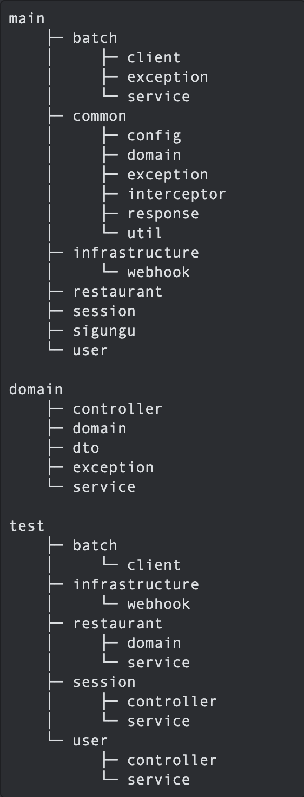

<br />
<br />

# 밥도둑

<br />

## 목차

* [📌 개발 기간](#-개발-기간)
* [📌 프로젝트 개요](#-프로젝트-개요)
* [📌 기술 스택](#-기술-스택)
* [📌 프로젝트 구조](#-프로젝트-구조)
* [📌 ERD](#-erd)
* [📌 구현 기능](#-구현-기능)
* [📌 이슈/해결 아카이브](#-이슈해결-아카이브)

<br />

## 📌 개발 기간

- 1차: 2023-10-31 ~ 2023-11-06
- 2차: 2023-11-06 ~ 2023-11-08

<br />

## 📌 프로젝트 개요

본 서비스는 공공데이터를 활용하여, 지역 음식점 목록을 자동으로 업데이트 하고 이를 활용합니다. 사용자 위치에맞게 맛집 및 메뉴를 추천하여 더 나은 다양한 음식 경험을 제공하고,
음식을 좋아하는 사람들 간의 소통과 공유를 촉진합니다.

<br />

## 📌 기술 스택

### 개발 환경

```
• IDE : IntelliJ IDEA Ultimate
• 언어 : Java 17
• 프레임워크 : Spring Boot 3.1.5
• 빌드 도구 : Gradle
• 데이터베이스 : MySQL 8.0
```

### 사용 기술

</a>
</a>
</a>
</a>
</a>
</a>
</a>
</a>
</a>
</a>
</a>
</a>
</a>

### 협업 도구

</a>
</a>
</a>
</a>
</a>

<br />

## 📌 프로젝트 구조



<br />

## 📌 ERD


<br />

## 📌 구현 기능


### 🏷️ API

#### User(사용자)

 Action    | Verbs |      URL Pattern      |
|:----------|:-----:|:---------------------:|
| 회원가입      | POST  |     /api/v1/users     |
| 로그인       | POST  |   /api/v1/sessions    |
| 액세스 토큰 갱신 | POST  | /api/v1/access-tokens |
| 업데이트      |  PUT  |   /api/v1/users/me     |
| 정보조회      | GET  |   /api/v1/users/me    |

#### Restaurant(맛집)

| Action   | Verbs |       URL Pattern        |
|:---------|:-----:|:------------------------:|
| 맛집 목록 조회 |  GET  |   /api/v1/restaurants    |
| 맛집 상세 조회 |  GET  | /api/v1/restaurants/{id} |

#### Review(평가)

| Action | Verbs  |                      URL Pattern                      |
|:------:|:------:|:-----------------------------------------------------:|
| 리뷰 생성  |  POST  |      /api/v1/restaurants/{restaurantId}/reivews       |
| 리뷰 수정  | PATCH  | /api/v1/restaurants/{restaurantId}/reivews/{reviewId} |
| 리뷰 삭제  | DELETE | /api/v1/restaurants/{restaurantId}/reivews/{reviewId} |

#### Sigungu(시군구)

| Action    | Verbs |     URL Pattern      |
|:----------|:-----:|:--------------------:|
| 시군구 목록 조회 |  GET  | /api/v1/sigungu/list |

### 🪝 Webhook 알림 송신
[WIKI page 바로가기](https://github.com/wanted-pre-onboarding-backend-team-s/bab-doduk/wiki/Discord-Webhook-%EC%95%8C%EB%A6%BC-%EC%86%A1%EC%8B%A0)

### 🗺️ OpenAPI 데이터 조회

- Open API로부터 43만 건의 데이터 조회 및 저장
- API 기능에 맞게 데이터 가공

<br />

## 📌 이슈/해결 아카이브

- 
