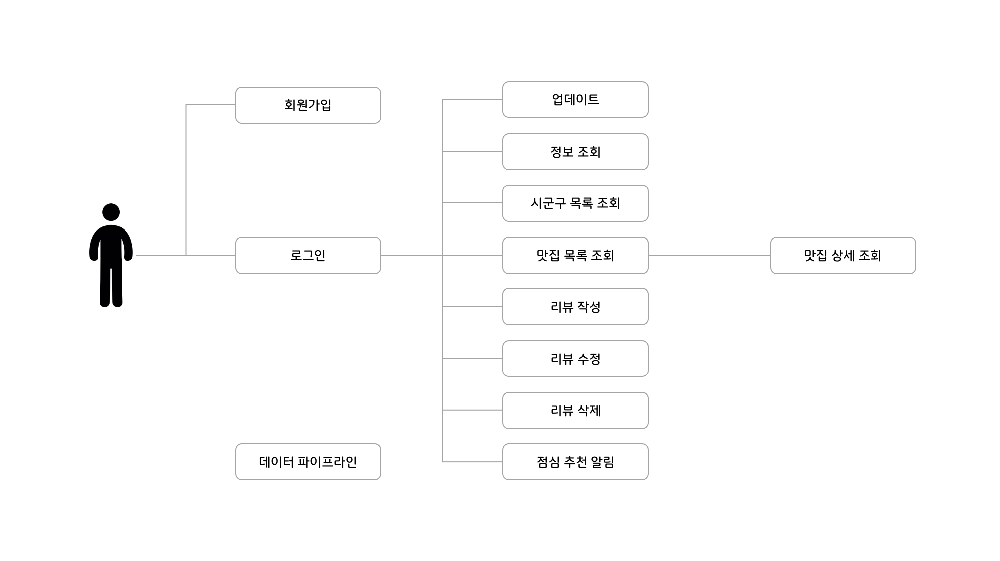

# 밥도둑

## 목차

- 개발 기간
- 프로젝트 개요
- 기술 스택
- 프로젝트 구조
- ERD
- 구현 기능
- Contribution
- 향후 계획

## 📌 개발 기간

- 1차: 2023-10-31 ~ 2023-11-06

## 📌 프로젝트 개요

본 서비스는 공공데이터를 활용하여, 지역 음식점 목록을 자동으로 업데이트 하고 이를 활용합니다. 사용자 위치에맞게 맛집 및 메뉴를 추천하여 더 나은 다양한 음식 경험을 제공하고,
음식을 좋아하는 사람들 간의 소통과 공유를 촉진하려 합니다.

## 📌 기술 스택

### 개발 환경

```
• IDE : IntelliJ IDEA Ultimate
• 언어 : Java 17
• 프레임워크 : Spring Boot 3.1.5
• 빌드 도구 : Gradle
• 데이터베이스 : MySQL 8.0
```

### 사용 기술

</a>
</a>
</a>
</a>
</a>
</a>
</a>
</a>
</a>
</a>
</a>
</a>
</a>

### 협업 도구

</a>
</a>
</a>
</a>
</a>

### 애플리케이션 실행 방법

```
1. Docker 컨테이너 실행
Docker를 사용하여 애플리케이션을 실행합니다.
docker-compose up -d

2. JAR 파일 생성
프로젝트의 JAR 파일을 생성합니다.
./gradlew bootJar
위 명령어는 애플리케이션의 빌드와 JAR 파일 생성을 수행합니다.

3. JAR 파일 실행
이제 생성된 JAR 파일을 실행하여 애플리케이션을 시작합니다.
java -jar ./build/libs/*.jar
애플리케이션이 성공적으로 실행되면 브라우저나 API 클라이언트를 통해 애플리케이션에 접근할 수 있습니다.
```

### 주의사항

- 프로젝트 실행 전에 Docker 및 Java 개발 환경이 설치되어 있어야 합니다.
- 만약 포트 번호가 충돌하는 경우 Docker 컨테이너 또는 애플리케이션의 설정을 조정하세요.
- 최초 애플리케이션 실행 시 Open API로부터 데이터를 가져오고 저장하기 위한 배치작업을 실행합니다. 실행하는 환경에 따라 다소 시간이 걸릴 수 있습니다. (약 43만건의
  데이터 저장)

## 📌 프로젝트 구조

- 삽입 필요 (Package Tree 생성기 활용)

## 📌 ERD

- 삽입 필요 

## 📌 구현 기능



### API

#### User(사용자)

 Action    | Verbs |      URL Pattern      |
|:----------|:-----:|:---------------------:|
| 회원가입      | POST  |     /api/v1/users     |
| 로그인       | POST  |   /api/v1/sessions    |
| 액세스 토큰 갱신 | POST  | /api/v1/access-tokens |
| 업데이트      |  PUT  |     /api/v1/users     |
| 정보조회      | POST  |   /api/v1/users/me    |

#### Restaurant(맛집)

| Action   | Verbs |       URL Pattern        |
|:---------|:-----:|:------------------------:|
| 맛집 목록 조회 |  GET  |   /api/v1/restaurants    |
| 맛집 상세 조회 |  GET  | /api/v1/restaurants/{id} |

#### Review(평가)

| Action | Verbs  |                      URL Pattern                      |
|:------:|:------:|:-----------------------------------------------------:|
| 리뷰 생성  |  POST  |      /api/v1/restaurants/{restaurantId}/reivews       |
| 리뷰 수정  | PATCH  | /api/v1/restaurants/{restaurantId}/reivews/{reviewId} |
| 리뷰 삭제  | DELETE | /api/v1/restaurants/{restaurantId}/reivews/{reviewId} |

#### Sigungu(시군구)

| Action    | Verbs |     URL Pattern      |
|:----------|:-----:|:--------------------:|
| 시군구 목록 조회 |  GET  | /api/v1/sigungu/list |

### Webhook 알림 송신

### OpenAPI 데이터 조회

## 📌 Contribution

### Refresh Token을 적용한 세션 관리

### DB 인덱스를 사용한 쿼리 성능 최적화

### 멀티스레딩을 이용한 API 조회 속도 개선

## 📌 향후 계획
